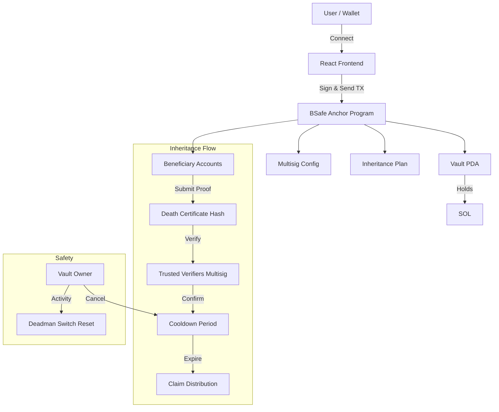
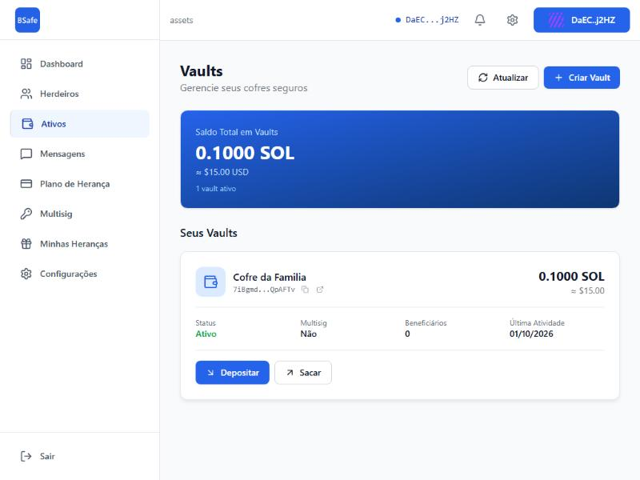
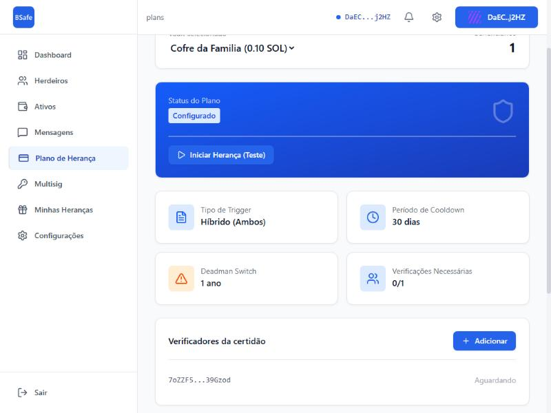
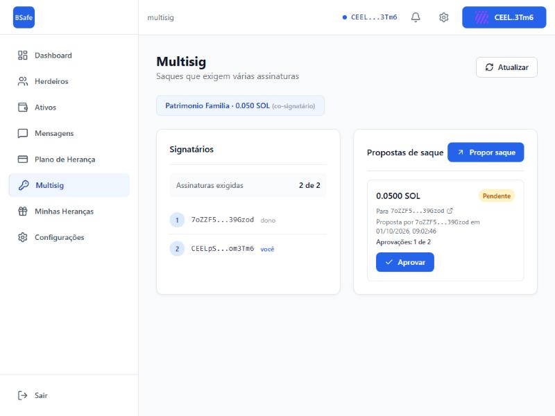
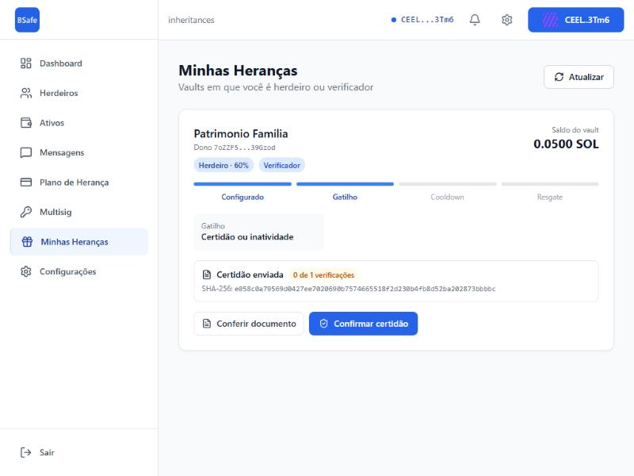

# BSafe - Digital Inheritance for Crypto Assets

> Non-custodial multisig wallet with automated digital inheritance on Solana.

**Built for Colosseum Crypto World's Fair Hackathon 2026**

## The Problem

Over **$100 billion** in cryptocurrency is at risk of being permanently lost when holders pass away without proper succession planning. Traditional inheritance systems fail with crypto because:

- Private keys can't go through probate courts
- Hardware wallets become useless without seed phrases
- Centralized exchanges require lengthy legal processes
- No automated on-chain solution exists for Solana

## The Solution

BSafe is an on-chain inheritance protocol that allows crypto holders to:

- Create secure vaults with multisig control
- Designate beneficiaries with percentage-based distribution
- Configure inheritance triggers (death certificate verification + deadman switch)
- Include a cooldown period for false-trigger protection
- Ensure non-custodial, trustless asset transfer

## How It Works

```
1. CREATE VAULT      2. ADD BENEFICIARIES     3. CONFIGURE PLAN
   +--------+           +--------+               +--------+
   | Vault  |  ------>  |  60%   |  --------->  | 30 day |
   | + SOL  |           |  40%   |              |cooldown|
   +--------+           +--------+               +--------+
                                                      |
                                                      v
4. TRIGGER EVENT     5. COOLDOWN              6. CLAIM
   +--------+           +--------+               +--------+
   | Proof  |  ------>  | Owner  |  --------->  | Funds  |
   | Submit |           | Cancel?|              |Distribute
   +--------+           +--------+               +--------+
```

### Detailed Flow

1. **Create Vault** - Deposit SOL into a PDA-controlled vault
2. **Add Beneficiaries** - Assign wallet addresses with share percentages (must sum to 100%)
3. **Configure Inheritance** - Set trigger type, cooldown period, and deadman switch interval
4. **Trigger Event** - Beneficiary submits proof (death certificate hash), verified by trusted multisig
5. **Cooldown** - Owner has X days to cancel (proves they're alive)
6. **Claim** - After cooldown, beneficiaries withdraw their shares automatically

## Architecture



## Tech Stack

| Component | Technology |
|-----------|------------|
| Smart Contract | Anchor (Rust) on Solana |
| Frontend | React 19 + TypeScript + Vite |
| Styling | Tailwind CSS |
| Wallet | Phantom, Solflare via Wallet Adapter |
| Network | Solana Devnet |

## Program ID (Devnet)

```
3a7Yvu89jRSMLDQJnLVepCNLENjckrK1ntQznChmp3Kv
```

[View on Solana Explorer](https://explorer.solana.com/address/3a7Yvu89jRSMLDQJnLVepCNLENjckrK1ntQznChmp3Kv?cluster=devnet)

## Live Demo

**https://bsafe-jade.vercel.app** (Solana Devnet — connect Phantom or Solflare set to Devnet)

## Screenshots

| | |
|---|---|
|  |  |
| Landing page | Vaults: deposit and withdraw |
|  |  |
| Inheritance plan and certificate verifiers | Multisig: signers and withdrawal proposals |
|  | |
| Heir / verifier view: certificate hash, cooldown, claim | |

## Getting Started

### Prerequisites

- Node.js 18+
- Rust + Solana CLI + Anchor CLI
- Phantom wallet (browser extension)

### Smart Contract

```bash
# Build the program (.so) and IDL — Windows script, see DEPLOYMENT.md for details
anchoruild.bat

# Integration tests: run the compiled program in LiteSVM (9 end-to-end flows)
cd anchor/tests-svm
cargo test
```

The tests load `target/deploy/bsafe.so` and cover vault deposit/withdraw, share validation,
deadman-switch inheritance with three heirs and protocol fee, the death-certificate flow, owner
cancellation (which invalidates the certificate), and multisig proposals. They warp the clock, so
the 30-day deadman switch and the cooldown are exercised for real.

### Frontend

```bash
# Install dependencies
npm install

# Run development server
npm run dev

# Build for production
npm run build
```

### Environment

Copy `.env.example` to `.env` and configure if needed:

```bash
cp .env.example .env
```

## Project Structure

```
bsafe/
├── anchor/                    # Smart contract
│   ├── programs/bsafe/src/
│   │   ├── state/            # Account structs
│   │   │   ├── vault.rs
│   │   │   ├── beneficiary.rs
│   │   │   ├── inheritance.rs
│   │   │   ├── multisig_types.rs
│   │   │   └── membership.rs
│   │   ├── instructions/     # Program instructions
│   │   │   ├── vault/
│   │   │   ├── beneficiary/
│   │   │   ├── inheritance/
│   │   │   ├── multisig/
│   │   │   └── membership/
│   │   ├── errors.rs
│   │   └── lib.rs
│   ├── tests-svm/            # LiteSVM integration tests (Rust)
│   └── scripts/              # IDL generation, treasury init
├── src/                       # React frontend
│   ├── components/
│   ├── hooks/
│   │   └── useProgram.ts     # On-chain interactions
│   ├── pages/
│   │   └── dashboard/
│   ├── lib/
│   │   ├── constants.ts
│   │   ├── errors.ts         # Program error messages
│   │   └── pda.ts
│   └── contexts/
│       └── WalletProvider.tsx
├── docs/
│   ├── USER_GUIDE.md
│   ├── BUSINESS_MODEL.md
│   └── COMPETITOR_ANALYSIS.md
└── public/
    └── images/
```

## Key Features

| Feature | Description |
|---------|-------------|
| **Multisig Vault** | M-of-N signer threshold; propose, approve, reject and execute withdrawals |
| **Beneficiary Management** | Add/remove/update heirs with percentage shares (must total 100%) |
| **Death Certificate Verification** | Heir submits the SHA-256 hash of the document (computed in the browser, the file is never uploaded); owner-appointed verifiers confirm it on-chain |
| **Deadman Switch** | Anyone can trigger inheritance once the owner has been inactive for the configured period (30 days to 5 years) |
| **Cooldown Protection** | Owner can cancel during the cooldown (1 to 365 days); cancelling invalidates the certificate so it can't be reused |
| **On-chain Distribution** | Each heir claims their share after the cooldown; rounding dust is swept by the last claim |
| **Protocol Fee** | 1% of each claim on the Free tier, 0% on paid tiers, collected by a treasury PDA |

### Who uses which screen

| Role | Screens |
|------|---------|
| **Owner** | Vaults (deposit/withdraw), Heirs, Inheritance Plan (trigger, cooldown, verifiers, cancel/re-arm), Multisig |
| **Co-signer** | Multisig (approve and execute proposals on vaults they sign for) |
| **Heir** | My Inheritances (submit certificate, trigger, track cooldown, claim) |
| **Verifier** | My Inheritances (compare the document against the on-chain hash, confirm) |

## Security Considerations

- All account validations use Anchor constraints (`has_one`, `signer` checks)
- Overflow protection with checked arithmetic
- Rent recovery on account closure
- 40+ custom error codes, surfaced as readable messages in the UI
- Share validation ensures allocations sum to exactly 100%
- Cooldown period prevents hasty or false claims
- Vault funds sit in a PDA and only move through program-signed System Program transfers
- Multisig thresholds count real signer accounts only, and approval indices are never reused
- A cancelled inheritance closes the death-certificate proof; a new one needs fresh verification
- Not audited — devnet only

## Business Model

BSafe uses a freemium model:

| Tier | Price | Claim Fee | Vaults | Beneficiaries |
|------|-------|-----------|--------|---------------|
| Free | $0 | 1% | 1 | 3 |
| Premium | 1 SOL | 0% | 5 | 10 |
| Concierge | 50 SOL/yr | 0% | Unlimited | 50 |

Current status: the claim fee per tier is enforced on-chain and the membership instructions
(create/upgrade) are deployed. The per-tier vault and beneficiary limits are defined in the program
but not enforced yet, and the membership purchase flow has no UI yet.

See [BUSINESS_MODEL.md](docs/BUSINESS_MODEL.md) for full details.

## Roadmap

- [x] Core vault and beneficiary management
- [x] Multisig support
- [x] Inheritance flow (trigger, cooldown, claim)
- [x] Membership tiers (claim fee on-chain)
- [x] Heir, verifier and co-signer flows in the UI
- [ ] Enforce per-tier limits and membership purchase UI
- [ ] SPL token support
- [ ] Multi-chain expansion (Ethereum, Base)
- [ ] Mobile app
- [ ] Legal document templates

## Team

Built with passion for the Colosseum Hackathon.

## License

MIT License - see [LICENSE](LICENSE) file.

## Links

- [Live Demo](https://bsafe-jade.vercel.app)
- [Solana Explorer](https://explorer.solana.com/address/3a7Yvu89jRSMLDQJnLVepCNLENjckrK1ntQznChmp3Kv?cluster=devnet)
- [Deployment & build notes](DEPLOYMENT.md)
- [User Guide](docs/USER_GUIDE.md)
- [Business Model](docs/BUSINESS_MODEL.md)
- [Competitor Analysis](docs/COMPETITOR_ANALYSIS.md)

---

**BSafe** - Because your crypto legacy matters.
